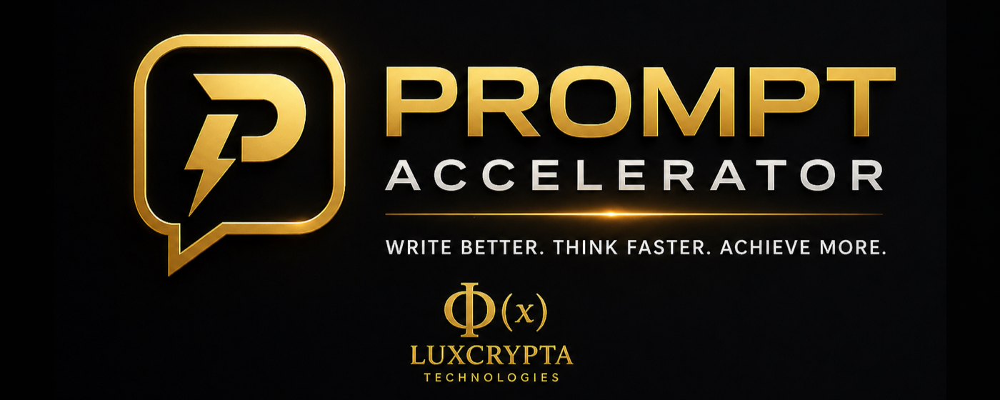
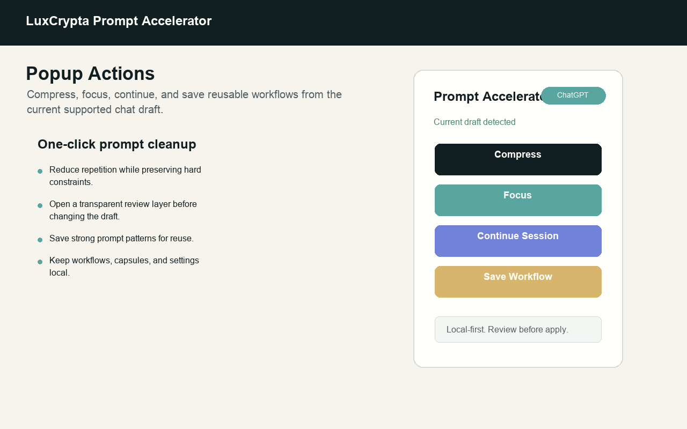
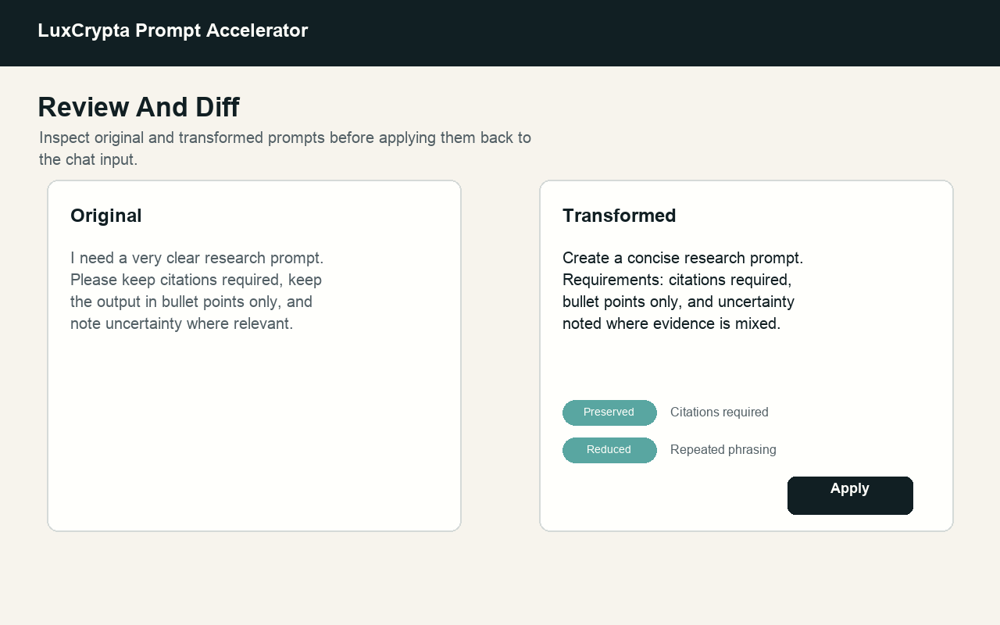
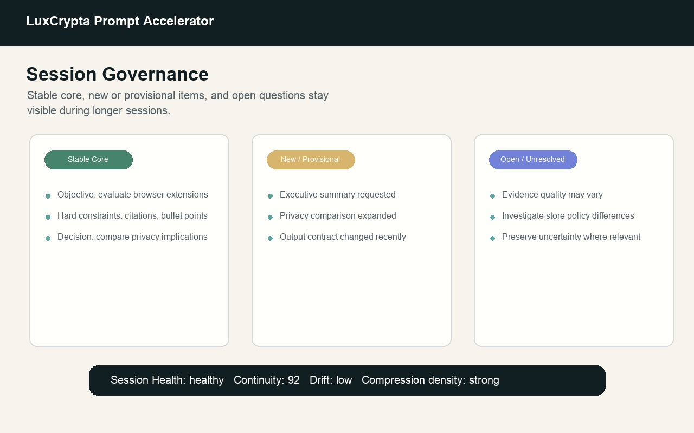

# LUXCRYPTA Prompt Accelerator

A lightweight operating layer for AI cognition and workflows.

LUXCRYPTA Prompt Accelerator is a browser-based continuity and workflow management layer designed to help users maintain stable, organized, and persistent AI work across long-running sessions.

## Simple By Default

Prompt Accelerator is designed to work immediately after installation.

There is no complicated setup process, no workflow configuration required, and no need to constantly manage the system manually. Once installed, the continuity layer begins working automatically in the background during supported AI sessions.

The default supported-chat experience is intentionally quiet: a passive Powered by LuxCrypta label and an Advanced control for inspection. Redundancy reduction, objective prioritization, and continuity shaping are runtime behavior, not separate modes the user has to choose.

Most users can simply install the extension and continue using their existing AI workflows normally while benefiting from improved continuity, reduced drift, and better long-session stability behind the scenes.

In other words:

Install it in seconds, use AI normally, and let the continuity layer work quietly in the background.

Modern AI systems are powerful, but extended workflows often become fragmented over time. Instructions get forgotten, objectives drift, important constraints disappear, unresolved questions get lost, and users are forced to repeatedly rebuild context just to continue working.

Prompt Accelerator was built to help reduce that workflow collapse.

Instead of treating AI interactions like isolated conversations, Prompt Accelerator helps organize them into structured, persistent working sessions by preserving workflow state, tracking active objectives, maintaining constraints, monitoring continuity, and helping users continue complex work without constantly restarting.

<p align="center">
  
</p>

## Preview

<p align="center">
  
  
</p>

<p align="center">
  
  
</p>

## Workflow Capabilities

The system introduces workflow-focused tools designed specifically for long-running AI-assisted work, including:

- Workflow continuity preservation
- Always-on redundancy reduction
- Objective-prioritized workflow steering
- Human-readable Advanced review
- Persistent session state tracking
- Continuity and drift monitoring
- Workflow save and restore
- Structured workspace persistence
- Stable vs provisional state separation
- Unresolved issue tracking
- Long-session workflow organization

Prompt Accelerator is especially useful for users managing extended AI workflows such as:

- Long-form research sessions
- Multi-step software planning
- Strategic writing and outlining
- Product planning
- Technical analysis
- Persistent AI-assisted projects
- Multi-session brainstorming and ideation
- Long-running structured conversations

For example:

A user conducting a multi-hour research session can preserve objectives, constraints, unresolved questions, and workflow structure without repeatedly rebuilding context every few prompts.

A developer working through a large architecture discussion can maintain continuity across planning sessions while tracking unresolved technical decisions and preserving workflow focus.

A strategist or analyst can organize ongoing AI-assisted planning sessions into persistent working environments rather than temporary chat threads.

## Always-On Continuity Runtime

Prompt Accelerator now treats continuity shaping as the default runtime behavior.

### Runtime

The extension automatically reduces repeated phrasing, prioritizes the active objective, preserves stable constraints, separates provisional changes, and keeps unresolved items visible during supported review flows.

### Advanced

Advanced opens an inspection-first continuity review with Clean Summary, Active Objective, Stable Core, New / Provisional, Open / Unresolved, What Changed, Recommended Next Actions, and collapsed diagnostics.

### Local Preservation

Workflow and capsule tools preserve reusable continuity state locally so longer sessions can be reviewed, exported, imported, and carried forward without silent cloud sync.

## Continuity Signals

The system also surfaces workflow continuity signals such as:

- continuity
- drift
- novelty
- openness

These signals help users better understand how stable or fragmented a workflow session is becoming over time.

## What This Is Not

Prompt Accelerator is not intended to replace AI models or function as a standalone AI system. Instead, it acts as a lightweight operating layer that helps organize, stabilize, and preserve long-running AI workflows across existing AI platforms.

The goal is simple:

Make long-running AI workflows more persistent, coherent, and reusable.

## Privacy

LuxCrypta Prompt Accelerator is designed to be local-first.

That means:

- No hidden telemetry.
- No silent cloud sync.
- No backend required for core functionality.
- Manual export/import only.
- User-triggered actions drive prompt and session processing.

The extension is designed to read only the page data needed for active user actions such as:

- Reading the current draft.
- Applying a transformed prompt.
- Generating a carry-forward capsule.
- Updating local session state.

It is not designed to silently harvest full chat histories or exfiltrate prompt content.

## Installation

Current build targets:

- Chromium-based browsers
- Firefox
- Electron desktop MVP

Load the packaged build or unpacked extension according to your browser's extension workflow.

## Browser Support

LuxCrypta Prompt Accelerator is built with a cross-browser architecture and packaged for Chromium and Firefox.

Supported chat surfaces:

- ChatGPT web: `chat.openai.com`, `chatgpt.com`
- Claude web: `claude.ai`
- Gemini web: `gemini.google.com`
- Grok web: `grok.com`

## Commands

```bash
npm install
npm run typecheck
npm test
npm run build:desktop
npm run desktop:dev
npm run package:desktop:mac
npm run package:desktop:mac:arm64
npm run package:desktop:mac:x64
npm run package:desktop:mac:unsigned
npm run package:desktop:win
npm run package:desktop:win:arm64
npm run package:desktop:win:x64
npm run package:desktop:linux
npm run package:desktop:linux:arm64
npm run package:desktop:linux:x64
npm run build:chromium
npm run build:firefox
npm run package:chromium
npm run package:firefox
npm run package:source
```

Extension build output is written to `dist/chromium` and `dist/firefox`.
Desktop build output is written to `dist/desktop`.
Desktop package artifacts are written to `release/desktop`.
macOS package commands are signing-ready; use the explicit unsigned command for controlled internal smoke builds.
Extension package zips are written to `packages/`.

Desktop release checklists live in `docs/desktop-release-checklist.md`, `docs/desktop-public-rc-signoff.md`, and `docs/desktop-rc-closeout-checklist.md`.

## Repo Layout

Shared continuity logic now lives in workspace packages under `packages/`. The browser extension shell lives in `apps/extension`, and the desktop MVP lives in `apps/desktop`.

## FAQ

### Does This Send My Prompts To A Server?

Core behavior is local-first. It does not rely on a backend for its main functionality.

### Is This A Model?

No. It is a browser extension that improves the prompt and session layer around AI chat.

### Does It Control The Model Internally?

No. It improves how instructions and continuity are structured before they reach the model.

### What Kinds Of Tasks Is It Useful For?

Research, writing, coding, planning, structured analysis, and long-running chat workflows.

### What Makes It Different From A Prompt Library?

It combines always-on continuity shaping, reusable workflows, visible review, carry-forward capsules, and governance-style session management in a local-first browser extension.

## Launch Materials

Public release notes, store copy, feature summary, privacy summary, and positioning language live in [`docs/launch-pack.md`](docs/launch-pack.md).

Store upload fields, permission justifications, privacy disclosure text, reviewer instructions, and package checklist live in [`docs/store-submission.md`](docs/store-submission.md).

Public website copy for the extension homepage, privacy policy, and support page lives in [`docs/store-web-pages.md`](docs/store-web-pages.md). Candidate store screenshots and promotional images live in [`store-assets/`](store-assets/).

## License

MIT License. See [`LICENSE`](LICENSE).
